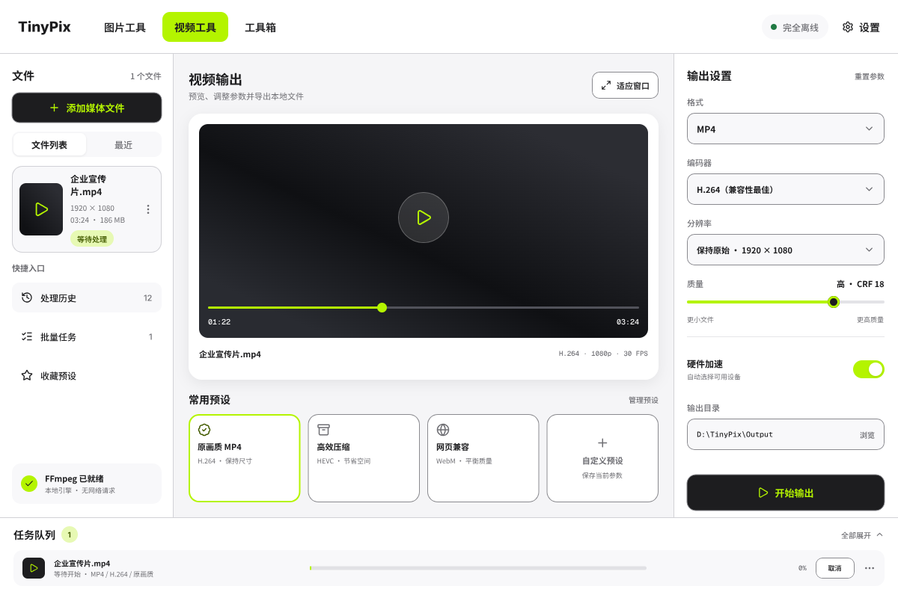
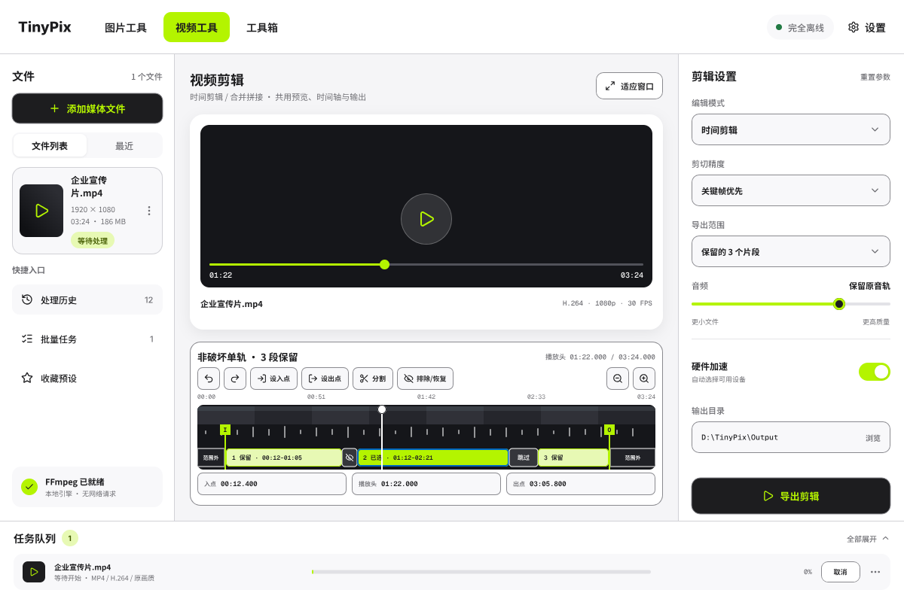
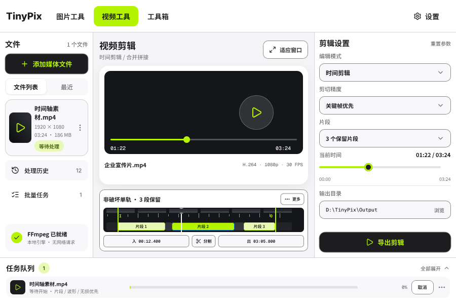
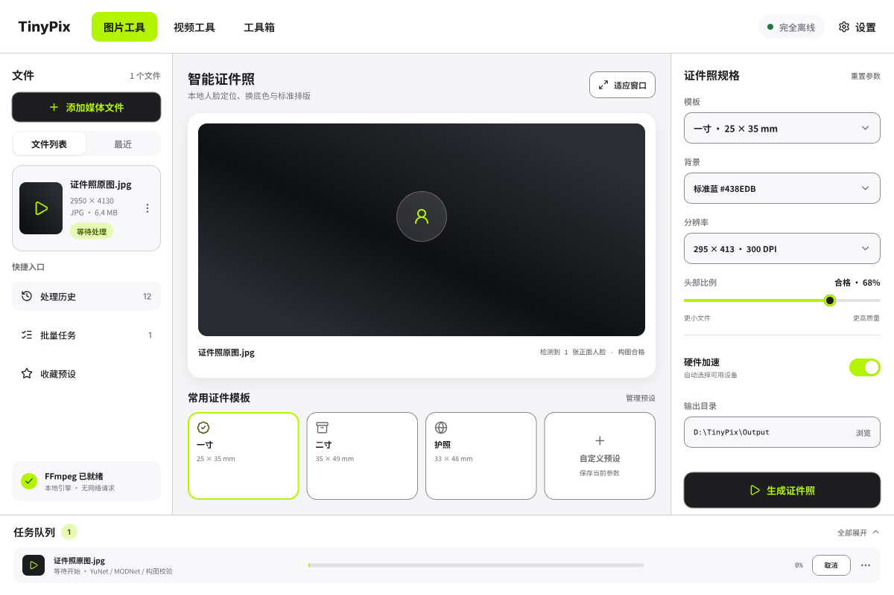
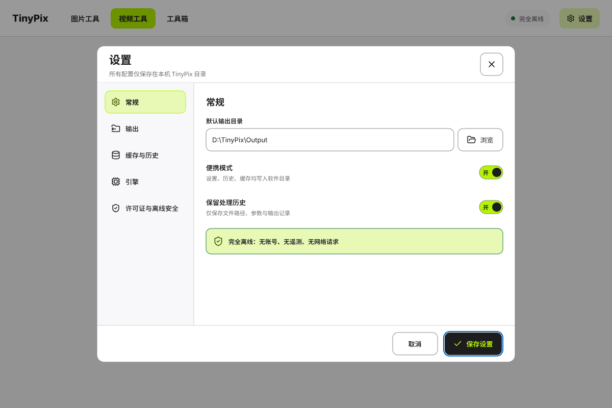
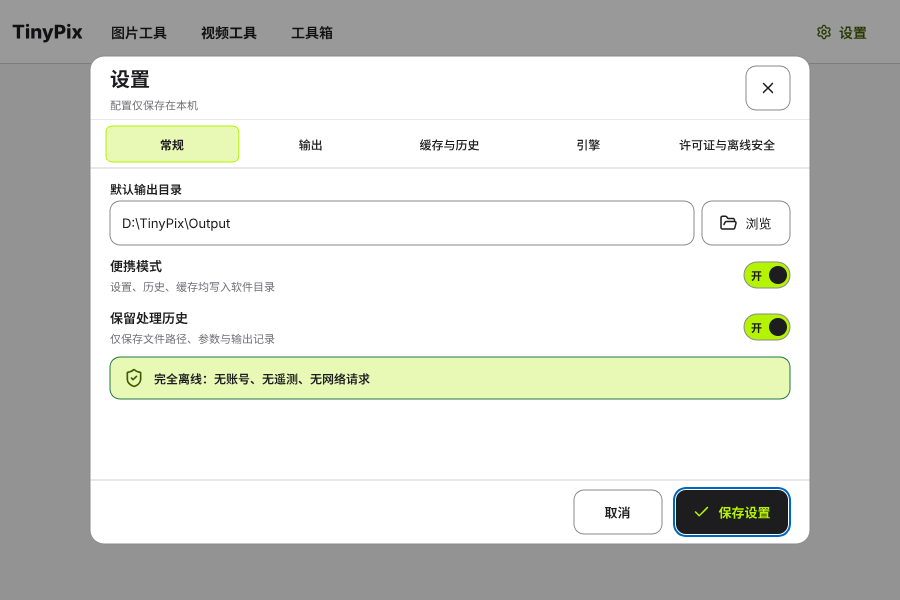
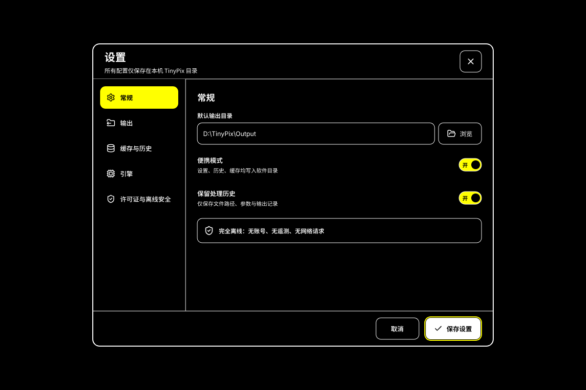

# TinyPix 4.0 UI recheck — 2026-07-19

## Scope and evidence

- Source: repository `design/TinyPix-4.0.pen`, opened and read through Pencil MCP.
- Inventory: 36 top-level nodes (35 boards plus the root-level reusable
  `SettingsDialog`) and 26 reusable components. Standard, compact,
  and High Contrast settings all reference the single reusable `SettingsDialog`.
- Current-run evidence: eight exported frames under `screenshots/`.
- Structural scan: video output, wide/compact timeline, ID photo, wide/compact
  settings, high-contrast settings, and compact QR generator all returned
  `No layout problems` from Pencil `snapshot_layout(problemsOnly=true)`.
- Evidence boundary: static frames can prove visible composition and specified
  states. They cannot prove real WinUI focus order, keyboard input, Narrator,
  display scaling, FFmpeg behavior, QR decodability, registry safety, or runtime
  theme resource resolution.

## Findings

1. **Video output — visually coherent; runtime pending.**
   The four-region shell, selected category, source item, preview, output
   controls, preset selection, primary action, and task queue have a consistent
   hierarchy. Lime surfaces use dark text/icons. No structural issue was
   reported in the 1200×800 frame.

   

2. **Video editing timeline — product direction is coherent; interaction gate
   remains.**
   The design uses one non-destructive single-track editor for trim, split, and
   multi-clip assembly instead of separate merge/trim pages. It exposes in/out
   range, playhead, kept/excluded segments, split, undo/redo, zoom, duration,
   and export settings. Wide and compact frames have no Pencil layout warning.
   Windows validation must still prove pointer hit targets, keyboard parity,
   scrolling/zooming, exact-frame vs keyframe behavior, undo, and export-range
   correctness.

   
   

3. **Smart ID photo — visually coherent; model workflow pending.**
   Source identity, detected-face status, physical template, background,
   pixels/DPI, head-ratio feedback, output directory, preset cards, and task
   state are aligned. Static evidence does not prove no-face/multi-face/side-face
   recovery or print-layout output.

   

4. **Settings — static design freeze passed.**
   The corrected standard and compact frames use a complete-root scrim over the
   application `XamlRoot`, including navigation. Together with the
   high-contrast frame, they are instances of one reusable `SettingsDialog`: the wide state uses
   a left category list, the compact state reflows categories across the top,
   and High Contrast changes system colors and focus treatment without creating
   another page, ViewModel, or save path. The compact state retains all three
   settings, all switches include visible on/off text, close/cancel/save use
   at least 44-pixel hit targets, and every evidence frame includes a visible
   save-button focus treatment. Standard and compact use separated blue outer
   focus rings; High Contrast uses a separated yellow outer focus ring so none
   can merge into the button surface. Pencil layout scans report no problem for all
   three frames. Runtime focus trapping and input blocking remain part
   of the Windows prototype gate.

   
   
   

5. **QR generator — visually coherent; scan result pending.**
   The compact frame uses a tool-specific source, live preview, output format,
   payload, size, error-correction level, output path, primary action, and task
   status. The exported QR could not be decoded in this macOS checkout because
   no QR decoder is installed; actual ZXing output and round-trip scan belong
   in the Windows/media integration gate.

   

## Decision

Static UI design health is **green and frozen**. The repository Pencil source,
UI specification, WinUI control mapping, and current exports agree on one
responsive, theme-aware settings dialog. This static freeze does not claim that
runtime UX has passed: keyboard, focus, Narrator, scaling, input blocking, media
behavior, registry safety, and Portable behavior remain gated by the disposable
Windows prototype and must not be inferred from Pencil.

## Required next action

1. Commit and synchronize the corrected Pencil source, exports, contracts, and
   this audit as one UI-freeze change.
2. Create a new task branch from synchronized `main` for the disposable Windows
   feasibility prototype; do not extend static pages while runtime gates remain.
3. Reopen the Pencil freeze only if runtime evidence proves a usability defect
   or a change to navigation, template structure, or the main task flow is needed.
